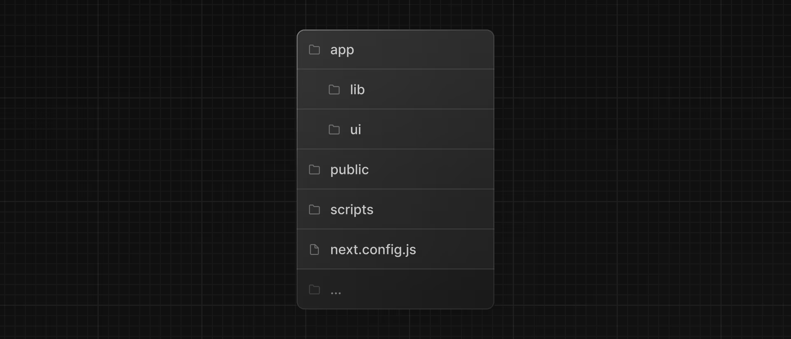
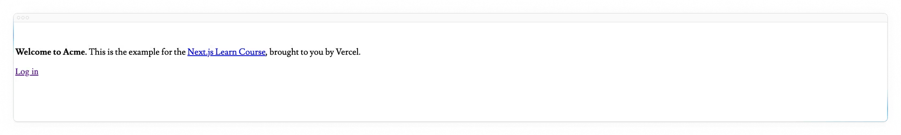

# Bab 1

## Memulai

### Membuat Proyek Baru

Kami merekomendasikan menggunakan pnpm sebagai manajer paket Anda, karena lebih cepat dan lebih efisien daripada npm atau yarn. Jika Anda belum menginstal pnpm, Anda dapat menginstalnya secara global dengan menjalankan perintah berikut:

```bash
npm install -g pnpm
```

Untuk membuat aplikasi Next.js, buka terminal Anda, masuk ke folder tempat Anda ingin menyimpan proyek, dan jalankan perintah berikut:

```bash
npx create-next-app@latest nextjs-dashboard --example "https://github.com/vercel/next-learn/tree/main/dashboard/starter-example" --use-pnpm
```

Perintah ini menggunakan create-next-app, sebuah alat Command Line Interface (CLI) yang menyiapkan aplikasi Next.js untuk Anda. Dalam perintah di atas, Anda juga menggunakan flag --example dengan contoh starter untuk kursus ini.

### Menjelajahi Proyek

Berbeda dengan tutorial yang mengharuskan Anda menulis kode dari awal, sebagian besar kode untuk kursus ini sudah ditulis untuk Anda. Ini lebih mencerminkan pengembangan dunia nyata, di mana Anda kemungkinan besar akan bekerja dengan basis kode yang sudah ada.

Tujuan kami adalah membantu Anda fokus mempelajari fitur utama Next.js, tanpa harus menulis semua kode aplikasi.

Setelah instalasi, buka proyek di editor kode Anda dan navigasikan ke nextjs-dashboard.

```bash
cd nextjs-dashboard-template
```

Mari kita luangkan waktu untuk menjelajahi proyek ini.

### Struktur Folder

Anda akan melihat bahwa proyek ini memiliki struktur folder berikut:

Struktur folder dari proyek dashboard, menunjukkan folder dan file utama: app, public, dan file konfigurasi.

- /app: Berisi semua rute, komponen, dan logika untuk aplikasi Anda, di sinilah Anda akan bekerja sebagian besar.
- /app/lib: Berisi fungsi-fungsi yang digunakan dalam aplikasi Anda, seperti fungsi utilitas yang dapat digunakan kembali dan fungsi pengambilan data.
- /app/ui: Berisi

semua komponen antarmuka pengguna untuk aplikasi Anda, seperti kartu, tabel, dan formulir. Untuk menghemat waktu, kami telah menata komponen-komponen ini untuk Anda.

- /public: Berisi semua aset statis untuk aplikasi Anda, seperti gambar.
- File Konfigurasi: Anda juga akan melihat file konfigurasi seperti next.config.js di root aplikasi Anda. Sebagian besar file ini dibuat dan dikonfigurasi sebelumnya saat Anda memulai proyek baru menggunakan create-next-app. Anda tidak perlu memodifikasinya dalam kursus ini.

Jelajahi folder-folder ini dengan bebas, dan jangan khawatir jika Anda belum memahami semua kode yang ada.

### Data Placeholder

Saat Anda membangun antarmuka pengguna, akan sangat membantu jika Anda memiliki beberapa data placeholder. Jika basis data atau API belum tersedia, Anda dapat:

- Menggunakan data placeholder dalam format JSON atau sebagai objek JavaScript.
- Menggunakan layanan pihak ketiga seperti mockAPI.

Untuk proyek ini, kami telah menyediakan beberapa data placeholder di app/lib/placeholder-data.ts. Setiap objek JavaScript dalam file tersebut mewakili tabel dalam basis data Anda. Misalnya, untuk tabel invoices:

```javascript
const invoices = [
  {
    customer_id: customers[0].id,
    amount: 15795,
    status: "pending",
    date: "2022-12-06",
  },
  {
    customer_id: customers[1].id,
    amount: 20348,
    status: "pending",
    date: "2022-11-14",
  },
  // ...
];
```

Pada bab tentang pengaturan basis data Anda, Anda akan menggunakan data ini untuk mengisi basis data Anda (mengisinya dengan beberapa data awal).

```javascript
// Contoh objek invoice
const invoice = {
  id: "1",
  customer_id: "123",
  amount: 15795,
  date: "2022-12-06",
  status: "pending", // Status ini bisa berupa 'pending' atau 'paid'
};
```

Dengan menggunakan komentar JSDoc, Anda dapat mendokumentasikan tipe data dan memberikan informasi tambahan yang berguna saat bekerja dengan editor kode yang mendukung JSDoc, seperti Visual Studio Code.

### Menjalankan Server Pengembangan

Jalankan `pnpm i` untuk menginstal paket proyek.

```bash
pnpm i
```

Diikuti oleh `pnpm dev` untuk memulai server pengembangan.

```bash
pnpm dev
```

`pnpm dev` akan memulai server pengembangan Next.js Anda pada port 3000. Mari kita cek apakah servernya berfungsi.

Buka http://localhost:3000 di browser Anda. Halaman beranda Anda harus terlihat seperti ini, yang sengaja tidak diberi gaya:

Halaman tanpa gaya dengan judul 'Acme', deskripsi, dan tautan login.
