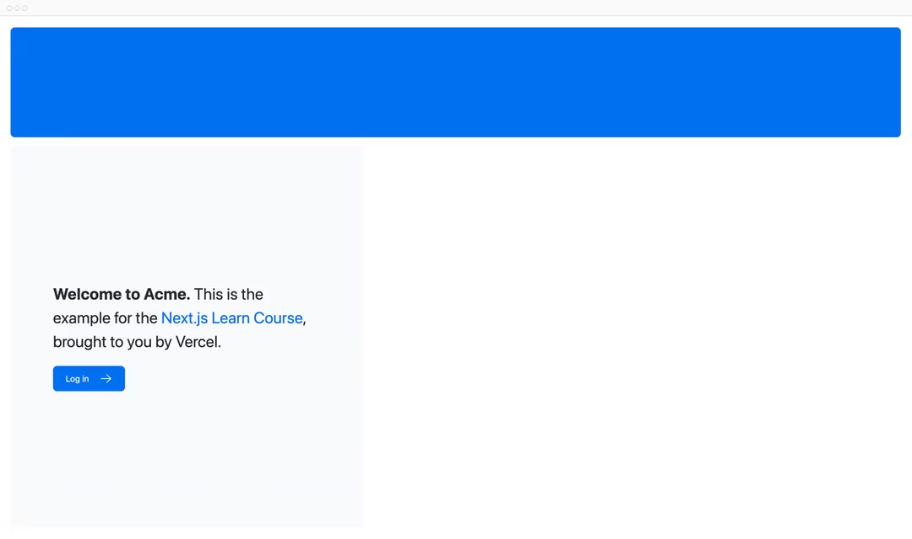

# Bab 2

## CSS Styling

Saat ini, halaman beranda Anda tidak memiliki gaya apa pun. Mari kita lihat berbagai cara untuk memberi gaya pada aplikasi Next.js Anda.

### Dalam bab ini...

Berikut adalah topik yang akan kita bahas:

- Cara menambahkan file CSS global ke aplikasi Anda.
- Dua cara berbeda dalam memberi gaya: Tailwind dan CSS modules.
- Cara menambahkan nama kelas secara kondisional dengan paket utilitas clsx.

### Gaya Global

Jika Anda melihat di dalam folder /app/ui, Anda akan melihat file bernama global.css. Anda dapat menggunakan file ini untuk menambahkan aturan CSS ke semua rute di aplikasi Anda - seperti aturan reset CSS, gaya di seluruh situs untuk elemen HTML seperti tautan, dan lainnya.

Anda dapat mengimpor global.css di komponen mana pun di aplikasi Anda, tetapi biasanya praktik yang baik adalah menambahkannya ke komponen tingkat atas Anda. Dalam Next.js, ini adalah layout root (lebih lanjut tentang ini nanti).

Tambahkan gaya global ke aplikasi Anda dengan menavigasi ke /app/layout.tsx dan mengimpor file global.css:

```javascript
// /app/layout.js

import "@/app/ui/global.css";

export default function RootLayout({ children }) {
  return (
    <html lang="en">
      <body>{children}</body>
    </html>
  );
}
```

Dengan server pengembangan masih berjalan, simpan perubahan Anda dan lihat pratinjau di browser. Halaman beranda Anda sekarang harus terlihat seperti ini:****

Halaman dengan gaya dengan logo 'Acme', deskripsi, dan tautan login.

Tapi tunggu **sebentar**, Anda tidak menambahkan aturan CSS apa pun, dari mana gaya ini berasal?

Jika Anda melihat di dalam global.css, Anda akan melihat beberapa direktif @tailwind:

```css
// /app/ui/global.css
@tailwind base;
@tailwind components;
@tailwind utilities;
```

### Tailwind

Tailwind adalah kerangka kerja CSS yang mempercepat proses pengembangan dengan memungkinkan Anda menulis kelas utilitas secara langsung di markup TSX Anda.

Dalam Tailwind, Anda memberi gaya pada elemen dengan menambahkan nama kelas. Misalnya, menambahkan kelas "text-blue-500" akan mengubah teksmenjadi biru:

```jsx
<h1 className="text-blue-500">I'm blue!</h1>
```

Meskipun gaya CSS dibagikan secara global, setiap kelas diterapkan secara tunggal ke setiap elemen. Ini berarti jika Anda menambah atau menghapus elemen, Anda tidak perlu khawatir tentang mempertahankan stylesheet terpisah, tabrakan gaya, atau ukuran bundle CSS yang meningkat saat aplikasi Anda berkembang.

Ketika Anda menggunakan create-next-app untuk memulai proyek baru, Next.js akan menanyakan apakah Anda ingin menggunakan Tailwind. Jika Anda memilih ya, Next.js akan secara otomatis menginstal paket yang diperlukan dan mengonfigurasi Tailwind di aplikasi Anda.

Jika Anda melihat di /app/page.tsx, Anda akan melihat bahwa kami menggunakan kelas Tailwind dalam contoh tersebut.

```javascript
// /app/page.x
import AcmeLogo from '@/app/ui/acme-logo';
import { ArrowRightIcon } from '@heroicons/react/24/outline';
import Link from 'next/link';

export default function Page() {
  return (
    // Ini adalah kelas Tailwind:
    <main className="flex min-h-screen flex-col p-6">
      <div className="flex h-20 shrink-0 items-end rounded-lg bg-blue-500 p-4 md:h-52">
    // ...
  )
}
```

Jangan khawatir jika ini adalah pertama kalinya Anda menggunakan Tailwind. Untuk menghemat waktu, kami telah menata semua komponen yang akan Anda gunakan.

Mari bermain dengan Tailwind! Salin kode di bawah ini dan tempelkan di atas elemen <p> di /app/page.tsx:

```jsx
// /app/page.tsx
<div className="relative w-0 h-0 border-l-[15px] border-r-[15px] border-b-[26px] border-l-transparent border-r-transparent border-b-black" />
```

### CSS Modules

CSS Modules memungkinkan Anda membuat skop CSS ke komponen dengan membuat nama kelas yang unik secara otomatis, sehingga Anda tidak perlu khawatir tentang tabrakan gaya.

Kami akan terus menggunakan Tailwind dalam kursus ini, tetapi mari kita lihat bagaimana Anda bisa mencapai hasil yang sama dari kuis di atas menggunakan CSS modules.

Di dalam /app/ui, buat file baru bernama home.module.css dan tambahkan aturan CSS berikut:

```css
// /app/ui/home.module.css
.shape {
  height: 0;
  width: 0;
  border-bottom: 30px solid black;
  border-left: 20px solid transparent;
  border-right: 20px solid transparent;
}
```

Kemudian, di dalam file /app/page.tsx Anda, impor gaya tersebut dan ganti nama kelas Tailwind dari yang telah Anda tambahkan dengan styles.shape:

```javascript
// /app/page.jsx
import AcmeLogo from "@/app/ui/acme-logo";
import { ArrowRightIcon } from "@heroicons/react/24/outline";
import Link from "next/link";

export default function Page() {
  return (
    <main className="flex flex-col min-h-screen p-6">
      <div className="flex items-end h-20 p-4 bg-blue-500 rounded-lg shrink-0 md:h-52">
        {/* <AcmeLogo /> */}
      </div>
      <div className="flex flex-col gap-4 mt-4 grow md:flex-row">
        <div className="flex flex-col justify-center gap-6 px-6 py-10 rounded-lg bg-gray-50 md:w-2/5 md:px-20">
          <p className="text-xl text-gray-800 md:text-3xl md:leading-normal">
            <strong>Welcome to Acme.</strong> This is the example for the{" "}
            <a href="https://nextjs.org/learn/" className="text-blue-500">
              Next.js Learn Course
            </a>
            , brought to you by devnolife - laboratorium-if-unismuh.
          </p>
          <Link
            href="/login"
            className="flex items-center self-start gap-5 px-6 py-3 text-sm font-medium text-white transition-colors bg-blue-500 rounded-lg hover:bg-blue-400 md:text-base"
          >
            <span>Log in</span>
          </Link>
        </div>
        <div className="flex items-center justify-center p-6 md:w-3/5 md:px-28 md:py-12">
          {/* Add Hero Images Here */}
        </div>
      </div>
    </main>
  );
}
```

Simpan perubahan Anda dan lihat pratinjau di browser. Anda harus melihat bentuk yang sama seperti sebelumnya.

Tailwind dan CSS modules adalah dua cara paling umum untuk memberi gaya pada aplikasi Next.js. Apakah Anda menggunakan salah satunya atau lainnya adalah masalah preferensi - Anda bahkan dapat menggunakan keduanya dalam aplikasi yang sama!

### Menggunakan pustaka clsx untuk toggle nama kelas

Mungkin ada kasus di mana Anda perlu memberi gaya pada elemen secara kondisional berdasarkan state atau kondisi lainnya.

clsx adalah pustaka yang memungkinkan Anda untuk toggle nama kelas dengan mudah. Kami merekomendasikan melihat dokumentasi untuk detail lebih lanjut, tetapi berikut adalah penggunaan dasarnya:

Misalkan Anda ingin membuat komponen InvoiceStatus yang menerima status. Statusnya bisa 'pending' atau 'paid'. Jika 'paid', Anda ingin warnanya menjadi hijau. Jika 'pending', Anda ingin warnanya menjadi abu-abu. Anda dapat menggunakan clsx untuk menerapkan kelas secara kondisional, seperti ini:

```javascript
// /app/ui/invoices/status.jsx
import { CheckIcon, ClockIcon } from "@heroicons/react/24/outline";
import clsx from "clsx";

export default function InvoiceStatus({ status }) {
  return (
    <span
      className={clsx(
        "inline-flex items-center rounded-full px-2 py-1 text-xs",
        {
          "bg-gray-100 text-gray-500": status === "pending",
          "bg-green-500 text-white": status === "paid",
        }
      )}
    >
      {status === "pending" ? (
        <>
          Pending
          <ClockIcon className="w-4 ml-1 text-gray-500" />
        </>
      ) : null}
      {status === "paid" ? (
        <>
          Paid
          <CheckIcon className="w-4 ml-1 text-white" />
        </>
      ) : null}
    </span>
  );
}
```

### Solusi styling lainnya

Selain pendekatan yang telah kita bahas, Anda juga dapat memberi gaya pada aplikasi Next.js Anda dengan:

- Sass yang memungkinkan Anda mengimpor file .css dan .scss.
- Pustaka CSS-in-JS seperti styled-jsx, styled-components, dan emotion.

Lihat dokumentasi CSS untuk informasi lebih lanjut.
