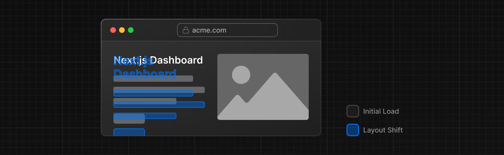
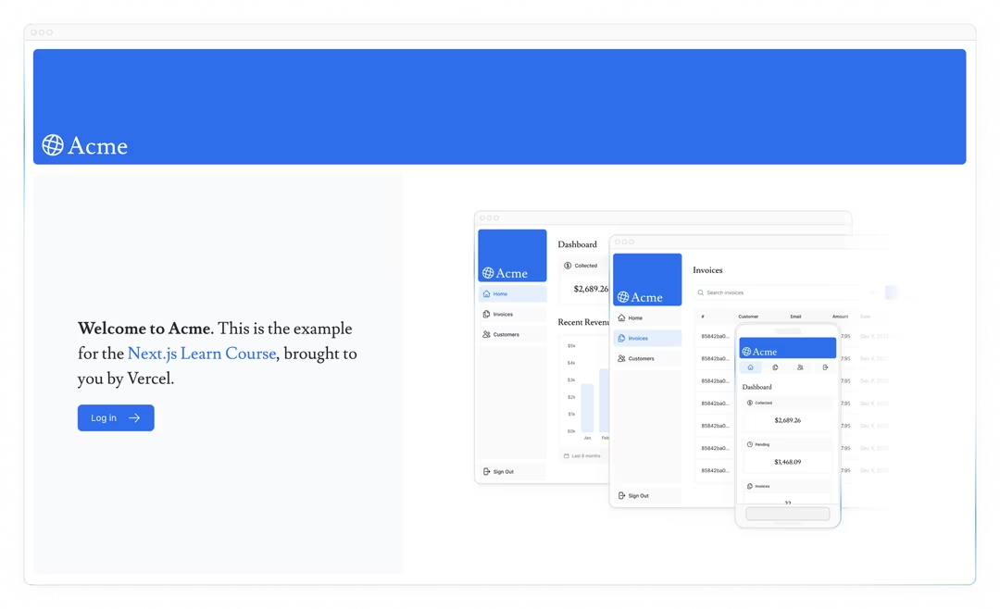

# Bab 3

## Optimizing Fonts and Images

Pada bab sebelumnya, Anda telah belajar cara memberi gaya pada aplikasi Next.js Anda. Mari lanjutkan bekerja pada halaman beranda Anda dengan menambahkan font kustom dan gambar hero.

### Dalam bab ini...

Berikut adalah topik yang akan kita bahas:

- Cara menambahkan font kustom dengan next/font.
- Cara menambahkan gambar dengan next/image.
- Bagaimana font dan gambar dioptimalkan dalam Next.js.

### Mengapa Mengoptimalkan Font?

Font memainkan peran penting dalam desain situs web, tetapi menggunakan font kustom dalam proyek Anda dapat memengaruhi performa jika file font perlu diambil dan dimuat.

Cumulative Layout Shift adalah metrik yang digunakan oleh Google untuk mengevaluasi performa dan pengalaman pengguna dari sebuah situs web. Dengan font, pergeseran tata letak terjadi ketika browser awalnya merender teks dalam font fallback atau sistem dan kemudian menggantinya dengan font kustom setelah dimuat. Pergantian ini dapat menyebabkan ukuran teks, spasi, atau tata letak berubah, menggeser elemen di sekitarnya.

Next.js secara otomatis mengoptimalkan font dalam aplikasi saat Anda menggunakan modul next/font. Ini mengunduh file font saat build time dan menghostingnya dengan aset statis lainnya. Ini berarti ketika pengguna mengunjungi aplikasi Anda, tidak ada permintaan jaringan tambahan untuk font yang akan mempengaruhi performa.

### Menambahkan Font Utama

Mari tambahkan font Google kustom ke aplikasi Anda untuk melihat cara kerjanya!

Di folder /app/ui, buat file baru bernama fonts.ts. Anda akan menggunakan file ini untuk menyimpan font yang akan digunakan di seluruh aplikasi Anda.

Impor font Inter dari modul next/font/google - ini akan menjadi font utama Anda. Kemudian, tentukan subset apa yang ingin Anda muat. Dalam hal ini, 'latin':

```javascript
// /app/ui/fonts.js
// font.js
export const lusitana = {
  className: "font-lusitana",
};
```

Terakhir, tambahkan font ke elemen di /app/layout.tsx:

```javascript
// /app/layout.jsx
export default function RootLayout({ children }) {
  return (
    <html lang="en">
      <body>{children}</body>
    </html>
  );
}
```

Dengan menambahkan Inter ke elemen, font akan diterapkan di seluruh aplikasi Anda. Di sini, Anda juga menambahkan kelas Tailwind `antialiased` yang memperhalus font. Ini tidak perlu digunakan, tetapi menambahkan sentuhan yang bagus.

Navigasikan ke browser Anda, buka dev tools dan pilih elemen body. Anda harus melihat Inter dan Inter_Fallback sekarang diterapkan di bawah styles.

### Latihan: Menambahkan Font Sekunder

Anda juga dapat menambahkan font ke elemen spesifik dari aplikasi Anda.

Sekarang giliran Anda! Di file fonts.ts Anda, impor font sekunder bernama Lusitana dan terapkan ke elemen di file /app/page.tsx Anda. Selain menentukan subset seperti yang Anda lakukan sebelumnya, Anda juga perlu menentukan berat font.

Setelah Anda siap, perluas cuplikan kode di bawah ini untuk melihat solusinya.

Petunjuk:

- Jika Anda tidak yakin opsi berat apa yang harus diterapkan ke font, periksa kesalahan TypeScript di editor kode Anda.
- Kunjungi situs web Google Fonts dan cari Lusitana untuk melihat opsi apa yang tersedia.
- Lihat dokumentasi untuk menambahkan beberapa font dan daftar lengkap opsi.

Terakhir, komponen <AcmeLogo /> juga menggunakan Lusitana. Ini dikomentari untuk mencegah kesalahan, Anda sekarang dapat menghapus komentarnya:

```javascript
// /app/page.tsx
export default function Page() {
  return (
    <main className="flex min-h-screen flex-col p-6">
      <div className="flex h-20 shrink-0 items-end rounded-lg bg-blue-500 p-4 md:h-52">
        <AcmeLogo />
        {/* ... */}
      </div>
    </main>
  );
}
```

Bagus, Anda telah menambahkan dua font kustom ke aplikasi Anda! Selanjutnya, mari tambahkan gambar hero ke halaman beranda.

### Mengapa Mengoptimalkan Gambar?

Next.js dapat menyajikan aset statis, seperti gambar, di bawah folder tingkat atas /public. File di dalam /public dapat direferensikan dalam aplikasi Anda.

Dengan HTML biasa, Anda akan menambahkan gambar sebagai berikut:

```html

```

Namun, ini berarti Anda harus secara manual:

- Memastikan gambar Anda responsif pada berbagai ukuran layar.
- Menentukan ukuran gambar untuk perangkat yang berbeda.
- Mencegah pergeseran tata letak saat gambar dimuat.
- Memuat gambar secara malas yang berada di luar viewport pengguna.

Optimisasi Gambar adalah topik besar dalam pengembangan web yang bisa dianggap sebagai spesialisasi tersendiri. Alih-alih mengimplementasikan optimisasi ini secara manual, Anda dapat menggunakan komponen next/image untuk mengoptimalkan gambar Anda secara otomatis.

### Komponen <Image>

Komponen <Image> adalah perpanjangan dari tag HTML , dan dilengkapi dengan optimisasi gambar otomatis, seperti:

- Mencegah pergeseran tata letak secara otomatis saat gambar dimuat.
- Mengubah ukuran gambar untuk menghindari pengiriman gambar besar ke perangkat dengan viewport lebih kecil.
- Memuat gambar secara malas secara default (gambar dimuat saat memasuki viewport).
- Menyajikan gambar dalam format modern, seperti WebP dan AVIF, saat browser mendukungnya.

### Menambahkan Gambar Hero Desktop

Mari kita gunakan komponen <Image>. Jika Anda melihat di dalam folder /public, Anda akan melihat ada dua gambar: hero-desktop.png dan hero-mobile.png. Kedua gambar ini sepenuhnya berbeda, dan akan ditampilkan tergantung apakah perangkat pengguna adalah desktop atau mobile.

Di file /app/page.tsx Anda, impor komponen dari next/image. Kemudian, tambahkan gambar di bawah komentar:

```javascript
// /app/page.js
import AcmeLogo from '@/app/ui/acme-logo';
import { ArrowRightIcon } from '@heroicons/react/24/outline';
import Link from 'next/link';

export default function Page() {
  return (
    <main className="flex flex-col min-h-screen p-6">
      <div className="flex items-end h-20 p-4 bg-blue-500 rounded-lg shrink-0 md:h-52">
        {/* <AcmeLogo /> */}
      </div>
      <div className="flex flex-col gap-4 mt-4 grow md:flex-row">
        <div className="flex flex-col justify-center gap-6 px-6 py-10 rounded-lg bg-gray-50 md:w-2/5 md:px-20">
          <p className="text-xl text-gray-800 md:text-3xl md:leading-normal">
            <strong>Welcome to Acme.</strong> This is the example for the{' '}
            <a href="https://nextjs.org/learn/" className="text-blue-500">
              Next.js Learn Course
            </a>
            , brought to you by devnolife - laboratorium-if-unismuh.
          </p>
          <Link
            href="/login"
            className="flex items-center self-start gap-5 px-6 py-3 text-sm font-medium text-white transition-colors bg-blue-500 rounded-lg hover:bg-blue-400 md:text-base"
          >
            <span>Log in</span>
          </Link>
        </div>
        <div className="flex items-center justify-center p-6 md:w-3/5 md:px-28 md:py-12">
          {/* Add Hero Images Here */}
        </div>
      </div>
    </main>
  );
}
```

Di sini, Anda menetapkan lebar 1000 dan tinggi 760 piksel. Adalah praktik yang baik untuk menetapkan lebar dan tinggi gambar Anda untuk menghindari pergeseran tata letak, ini harus memiliki rasio aspek yang identik dengan gambar sumber.

Anda juga akan melihat kelas `hidden` untuk menghapus gambar dari DOM di layar mobile, dan `md:block` untuk menampilkan gambar di layar desktop.

Inilah tampilan halaman beranda Anda sekarang:

Halaman beranda yang distilisasi dengan font kustom dan gambar hero.


### Latihan: Menambahkan Gambar Hero Mobile

Sekarang giliran Anda! Di bawah gambar yang baru saja Anda tambahkan, tambahkan komponen <Image> lain untuk hero-mobile.png.

- Gambar harus memiliki lebar 560 dan tinggi 620 piksel.
- Gambar harus ditampilkan di layar mobile, dan disembunyikan di desktop - Anda dapat menggunakan dev tools untuk memeriksa apakah gambar desktop dan mobile ditukar dengan benar.

Setelah Anda siap, perluas cuplikan kode di bawah ini untuk melihat solusinya.

Bagus! Halaman beranda Anda sekarang memiliki font kustom dan gambar hero.

### Bacaan yang Direkomendasikan

Masih banyak lagi yang bisa dipelajari tentang topik ini, termasuk mengoptimalkan gambar jarak jauh dan menggunakan file font lokal. Jika Anda ingin mendalami lebih jauh tentang font dan gambar, lihat:

- [Dokumentasi Optimisasi Gambar](https://nextjs.org/docs/basic-features/image-optimization)
- [Dokumentasi Optimisasi Font](https://nextjs.org/docs/basic-features/font-optimization)
- [Meningkatkan Performa Web dengan Gambar (MDN)](https://developer.mozilla.org/en-US/docs/Web/Performance/Optimizing_content_efficiency/Images)
- [Web Fonts (MDN)](https://developer.mozilla.org/en-US/docs/Web/CSS/@font-face)
- [Bagaimana Core Web Vitals Mempengaruhi SEO](https://web.dev/vitals/seo/)
