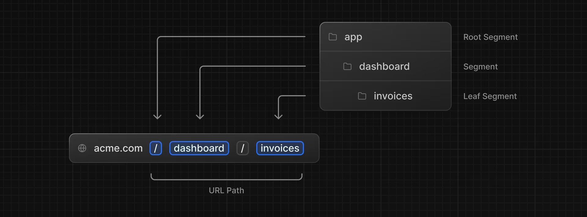
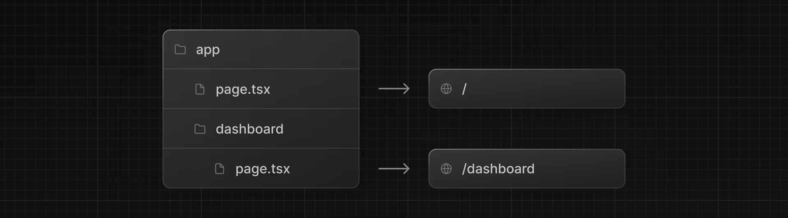
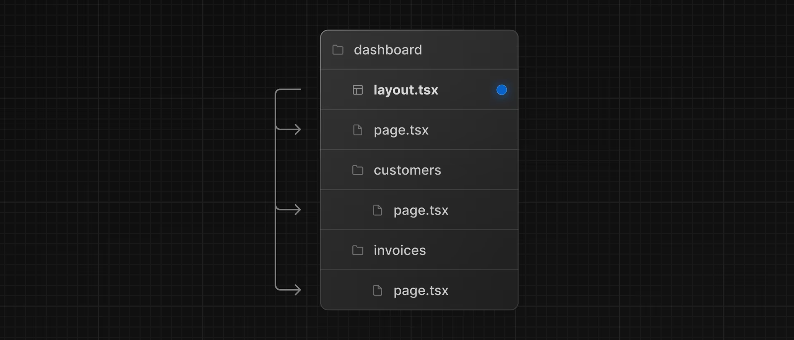
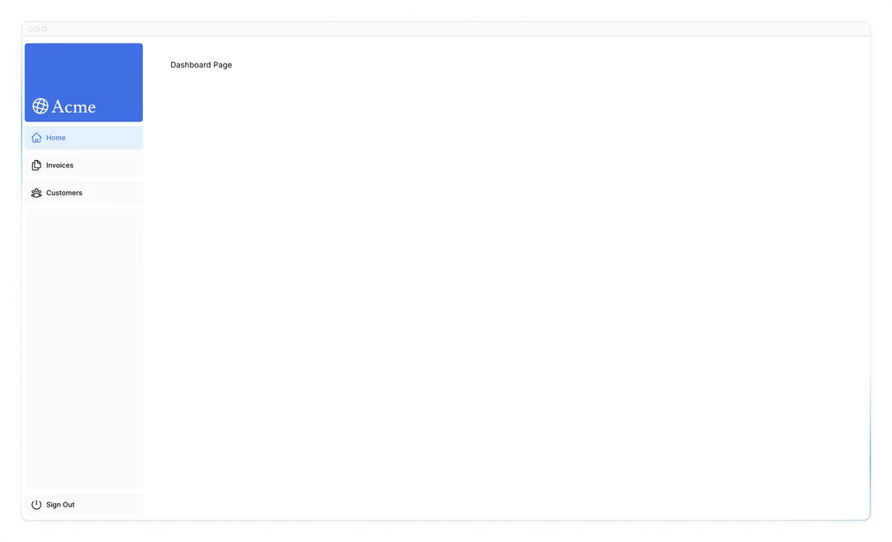
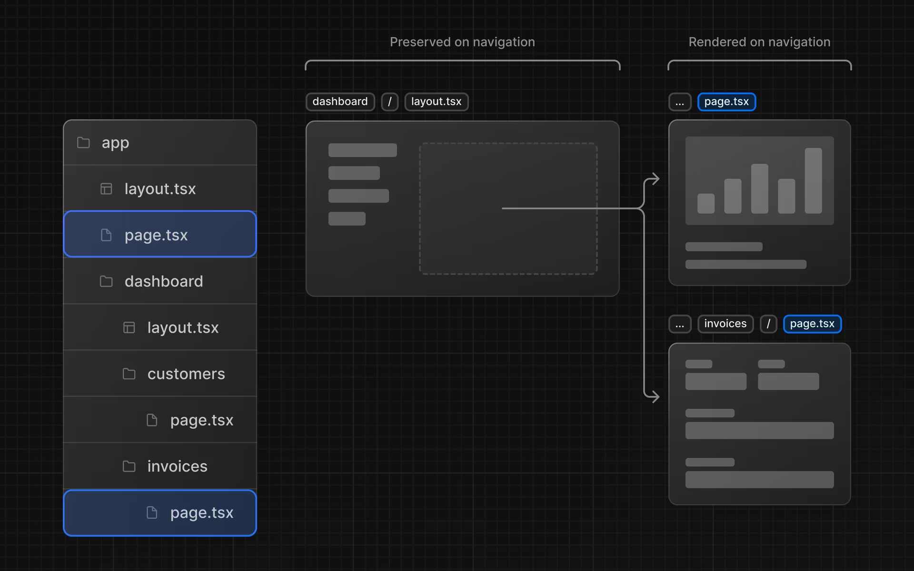

# Bab 4

## Creating Layouts and Pages

Sejauh ini, aplikasi Anda hanya memiliki halaman beranda. Mari pelajari cara membuat lebih banyak rute dengan layout dan halaman.

### Dalam bab ini...

Berikut adalah topik yang akan kita bahas:

- Membuat rute dashboard menggunakan file-system routing.
- Memahami peran folder dan file saat membuat segmen rute baru.
- Membuat layout bersarang yang dapat dibagikan antara beberapa halaman dashboard.
- Memahami apa itu colocation, partial rendering, dan root layout.

### Nested routing

Next.js menggunakan file-system routing di mana folder digunakan untuk membuat rute bersarang. Setiap folder mewakili segmen rute yang memetakan ke segmen URL.

Anda dapat membuat UI terpisah untuk setiap rute menggunakan file layout.tsx dan page.tsx.

page.tsx adalah file khusus Next.js yang mengekspor komponen React, dan ini diperlukan agar rute dapat diakses. Dalam aplikasi Anda, Anda sudah memiliki file halaman: /app/page.tsx - ini adalah halaman beranda yang terkait dengan rute /.

Untuk membuat rute bersarang, Anda dapat menyarangkan folder di dalam satu sama lain dan menambahkan file page.tsx di dalamnya. Misalnya:

/app/dashboard/page.tsx terkait dengan path /dashboard. Mari kita buat halaman untuk melihat cara kerjanya!

### Membuat Halaman Dashboard

Buat folder baru bernama dashboard di dalam /app. Kemudian, buat file page.tsx baru di dalam folder dashboard dengan konten berikut:

```javascript
// /app/dashboard/page.tsx
export default function Page() {
  return <p>Dashboard Page</p>;
}
```

Sekarang, pastikan server pengembangan berjalan dan kunjungi http://localhost:3000/dashboard. Anda harus melihat teks "Dashboard Page".

Inilah cara Anda dapat membuat halaman berbeda di Next.js: buat segmen rute baru menggunakan folder, dan tambahkan file halaman di dalamnya.

Dengan memiliki nama khusus untuk file halaman, Next.js memungkinkan Anda untuk menempatkan komponen UI, file uji, dan kode terkait lainnya bersama rute Anda. Hanya konten di dalam file halaman yang akan dapat diakses secara publik. Misalnya, folder /ui dan /lib ditempatkan di dalam folder /app bersama rute Anda.

### Latihan: Membuat Halaman Dashboard

Mari berlatih membuat lebih banyak rute. Di dashboard Anda, buat dua halaman lagi:

- **Customers Page**: Halaman ini harus dapat diakses di http://localhost:3000/dashboard/customers. Untuk saat ini, halaman ini harus mengembalikan elemen <p>Customers Page</p>.
- **Invoices Page**: Halaman invoices harus dapat diakses di http://localhost:3000/dashboard/invoices. Untuk saat ini, juga kembalikan elemen <p>Invoices Page</p>.

Luangkan waktu untuk menangani latihan ini, dan ketika Anda siap, perluas toggle di bawah untuk melihat solusinya:

### Membuat Layout Dashboard

Dashboard memiliki beberapa jenis navigasi yang dibagikan di antara beberapa halaman. Di Next.js, Anda dapat menggunakan file layout.tsx khusus untuk membuat UI yang dibagikan antara beberapa halaman. Mari kita buat layout untuk halaman dashboard!

Di dalam folder /dashboard, tambahkan file baru bernama layout.tsx dan tempelkan kode berikut:

```javascript
// /app/dashboard/layout.tsx
iimport SideNav from '@/app/ui/dashboard/sidenav';

export default function Layout({ children }) {
  return (
    <div className="flex flex-col h-screen md:flex-row md:overflow-hidden">
      <div className="flex-none w-full md:w-64">
        <SideNav />
      </div>
      <div className="flex-grow p-6 md:overflow-y-auto md:p-12">{children}</div>
    </div>
  );
}
```

Beberapa hal terjadi dalam kode ini, jadi mari kita uraikan:

- Pertama, Anda mengimpor komponen <SideNav /> ke dalam layout Anda. Setiap komponen yang Anda impor ke file ini akan menjadi bagian dari layout.
- Komponen <Layout /> menerima prop children. Anak ini bisa berupa halaman atau layout lain. Dalam kasus Anda, halaman di dalam /dashboard akan secara otomatis disarangkan di dalam <Layout /> seperti ini:
  
  Pastikan semuanya bekerja dengan benar dengan menyimpan perubahan Anda dan memeriksa localhost Anda. Anda harus melihat:
  
  Salah satu manfaat menggunakan layout di Next.js adalah bahwa pada navigasi, hanya komponen halaman yang diperbarui sementara layout tidak akan di-render ulang. Ini disebut partial rendering:
  

### Root Layout

Di Bab 3, Anda mengimpor font Inter ke layout lain: /app/layout.tsx. Sebagai pengingat:

```javascript
// /app/layout.jsx
}
import '@/app/ui/global.css';
import { inter } from '@/app/ui/fonts';
export default function RootLayout({
  children,
}) {
  return (
    <html lang="en">
      <body className={`${inter.className} antialiased`}>{children}</body>
    </html>
  );
}
```

Ini disebut root layout dan diperlukan. UI apa pun yang Anda tambahkan ke root layout akan dibagikan di semua halaman dalam aplikasi Anda. Anda dapat menggunakan root layout untuk memodifikasi tag <html> dan <body>, serta menambahkan metadata (Anda akan belajar lebih banyak tentang metadata di bab selanjutnya).

Karena layout baru yang baru saja Anda buat (/app/dashboard/layout.tsx) unik untuk halaman dashboard, Anda tidak perlu menambahkan UI apa pun ke root layout di atas.
